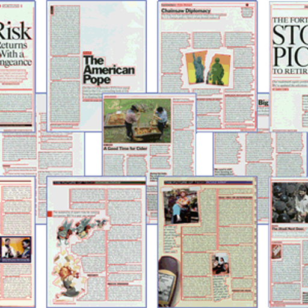

# Document Layout Detection




This dataset has been created primarily for the evaluation of layout analysis (physical and logical) methods. It contains realistic 
documents with a wide variety of layouts, reflecting the various challenges in layout analysis.

Dataset has four classes:

* Text Region
* Seperation Region
* Noise Region
* Image Region

### Format of Dataset


### Prerequisites

* [Python3](https://www.python.org/) - Python version 3.6
* [CUDA](https://developer.nvidia.com/cuda-90-download-archive) - CUDA version 9.0

## Pipeline

Run the requirements.txt 

```
cat requirements.txt | xargs -n 1 -L 1 pip install
```
Convert to COCO format


Load Dataset

```
gtf.Train_Dataset(root_dir="../sample_dataset", coco_dir="PRImA Layout Analysis Dataset", img_dir="Images", set_dir="Train", batch_size=8, image_size=512, use_gpu=True)
```
Load Model

```
gtf.Model()
```
Set Hyper Parameters

```
gtf.Set_Hyperparams(lr=0.0001, val_interval=1, es_min_delta=0.0, es_patience=0)
```
To View Loss Plots (Optional)
```
logs_base_dir = "tensorboard/signatrix_efficientdet_coco"
os.makedirs(logs_base_dir, exist_ok=True)
%load_ext tensorboard
%tensorboard --logdir {logs_base_dir}
```
Start the training 

```
gtf.Train(num_epochs=2, model_output_dir="trained/")
```


## Acknowledgments

* [MONK_OBJECT_DETECTION](https://github.com/Tessellate-Imaging/Monk_Object_Detection)
* [DATASET](https://www.primaresearch.org/datasets/Layout_Analysis)

